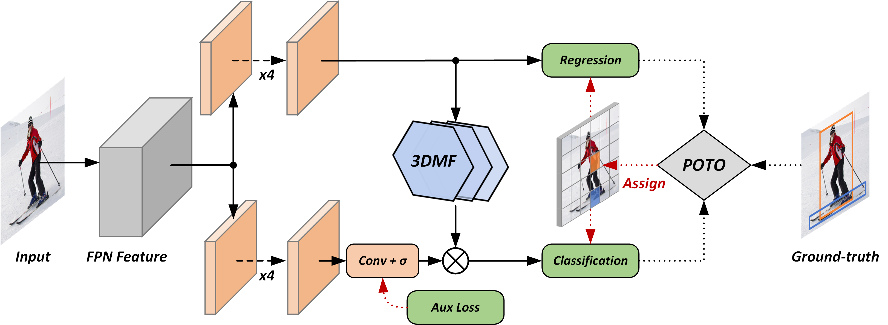

# End-to-End Object Detection with Fully Convolutional Network


This project provides an implementation for "[End-to-End Object Detection with Fully Convolutional Network](https://arxiv.org/abs/2012.03544)" on PyTorch.

For the reason that experiments in the paper were conducted using internal framework, this project reimplements them on cvpods and reports detailed comparisons below.



## Requirements
* [cvpods](https://github.com/Megvii-BaseDetection/cvpods)
* scipy >= 1.5.4

## Get Started

* install cvpods locally (requires cuda to compile)
```shell

python3 -m pip install 'git+https://github.com/Megvii-BaseDetection/cvpods.git'
# (add --user if you don't have permission)

# Or, to install it from a local clone:
git clone https://github.com/Megvii-BaseDetection/cvpods.git
python3 -m pip install -e cvpods

# Or,
pip install -r requirements.txt
python3 setup.py build develop
```

* prepare datasets
```shell
cd /path/to/cvpods
cd datasets
ln -s /path/to/your/coco/dataset coco
```

* Train & Test
```shell
git clone https://github.com/Megvii-BaseDetection/DeFCN.git
cd DeFCN/playground/detection/coco/poto.res50.fpn.coco.800size.3x_ms  # for example

# Train
pods_train --num-gpus 8

# Test
pods_test --num-gpus 8 \
    MODEL.WEIGHTS /path/to/your/save_dir/ckpt.pth # optional
    OUTPUT_DIR /path/to/your/save_dir # optional

# Multi node training
## sudo apt install net-tools ifconfig
pods_train --num-gpus 8 --num-machines N --machine-rank 0/1/.../N-1 --dist-url "tcp://MASTER_IP:port"

```

## Results on COCO2017 val set

| Model | Assignment | with NMS | training schedule | mAP | mAR |
|:------|:----------:|:--------:|:-----------------:|:---:|:---:|
| [FCOS](./playground/detection/coco/fcos.res50.fpn.coco.800size.3x_ms) | one-to-many | Yes | 3x + ms | coming soon |  |
| [FCOS baseline](./playground/detection/coco/fcos.res50.fpn.coco.800size.3x_ms.wo_ctrness) | one-to-many | Yes | 3x + ms | coming soon |  |
| [Anchor](./playground/detection/coco/anchor.res50.fpn.coco.800size.3x_ms) | one-to-one | No | 3x + ms | coming soon |  |
| [Center](./playground/detection/coco/center.res50.fpn.coco.800size.3x_ms) | one-to-one | No | 3x + ms | coming soon |  |
| [Foreground Loss](./playground/detection/coco/loss.res50.fpn.coco.800size.3x_ms) | one-to-one | No | 3x + ms | 38.5 | 62.2 |
| [POTO](./playground/detection/coco/poto.res50.fpn.coco.800size.3x_ms) | one-to-one | No | 3x + ms | 39.0 | 61.6 |
| [POTO + 3DMF](./playground/detection/coco/poto.res50.fpn.coco.800size.3x_ms.3dmf) | one-to-one | No | 3x + ms | 40.3 | 61.4 |
| [POTO + 3DMF + Aux](./playground/detection/coco/poto.res50.fpn.coco.800size.3x_ms.3dmf.aux) | mixture\* | No | 3x + ms | 41.5 | 61.4 |
| [POTO](./playground/detection/coco/poto.res50.fpn.coco.800size.6x_ms) | one-to-one | No | 6x + ms | 40.4 | 62.3 |

\* We adopt a one-to-one assignment in POTO and a one-to-many assignment in the auxiliary loss, respectively.

- `2x + ms` schedule is adopted in the paper, but we adopt `3x + ms` schedule here to achieve higher performance.
- It's normal to observe ~0.3AP noise in POTO.

## Results on CrowdHuman val set

| Model | Assignment | with NMS | training schedule | AP50 | mMR | Recall |
|:------|:----------:|:--------:|:-----------------:|:----:|:---:|:------:|
| [FCOS](./playground/detection/crowdhuman/fcos.res50.fpn.crowdhuman.800size.30k) | one-to-many | Yes | 30k iters | 86.0 | 55.2 | 94.1 |
| [ATSS](./playground/detection/crowdhuman/atss.res50.fpn.crowdhuman.800size.30k) | one-to-many | Yes | 30k iters | 87.1 | 50.3 | 94.0 |
| [POTO](./playground/detection/crowdhuman/poto.res50.fpn.crowdhuman.800size.30k) | one-to-one | No | 30k iters | 88.7 | 52.0 | 96.5 |
| [POTO + 3DMF](./playground/detection/crowdhuman/poto.res50.fpn.crowdhuman.800size.30k.3dmf) | one-to-one | No | 30k iters | 89.0 | 51.3 | 96.9 |
| [POTO + 3DMF + Aux](./playground/detection/crowdhuman/poto.res50.fpn.crowdhuman.800size.30k.3dmf.aux) | mixture\* | No | 30k iters | 89.3 | 48.9 | 96.6 |

\* We adopt a one-to-one assignment in POTO and a one-to-many assignment in the auxiliary loss, respectively.

- It's normal to observe ~0.3AP noise in POTO, and ~1.0mMR noise in all methods.

## Acknowledgement
This repo is developed based on cvpods. Please check [cvpods](https://github.com/Megvii-BaseDetection/cvpods) for more details and features.

## License
This repo is released under the Apache 2.0 license. Please see the LICENSE file for more information.

## Citing
If you use this work in your research or wish to refer to the baseline results published here, please use the following BibTeX entries:
```
@article{wang2020end,
  title   =  {End-to-End Object Detection with Fully Convolutional Network},
  author  =  {Wang, Jianfeng and Song, Lin and Li, Zeming and Sun, Hongbin and Sun, Jian and Zheng, Nanning},
  journal =  {arXiv preprint arXiv:2012.03544},
  year    =  {2020}
}
```

## Contributing to the project
Any pull requests or issues are welcome.
